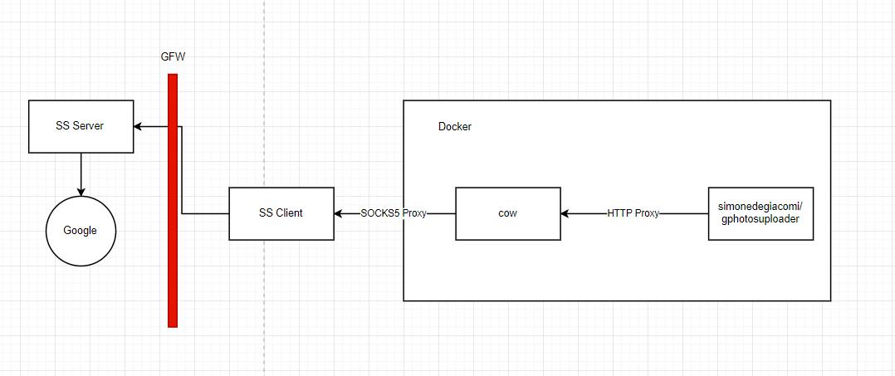
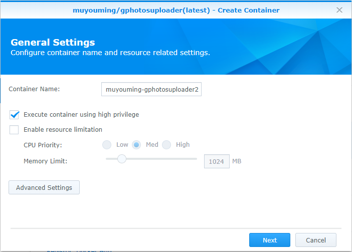
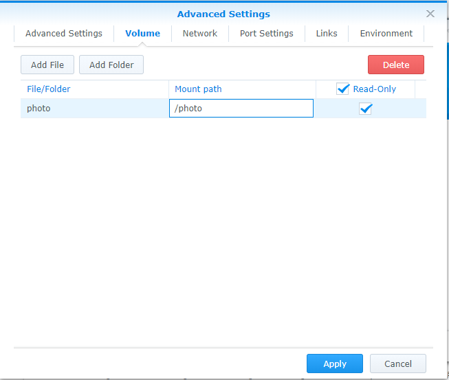
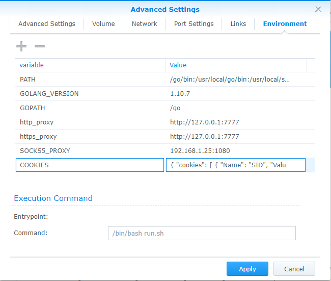
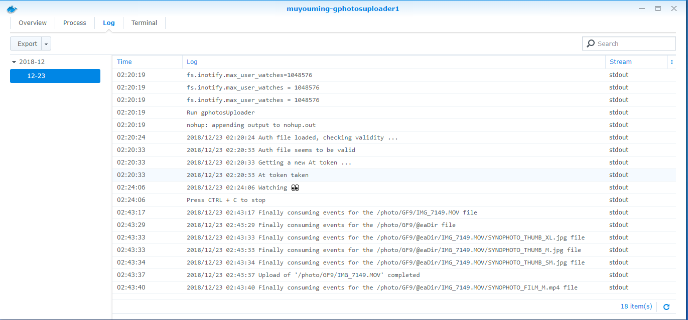

Google Photo uploader Docker for Synology

Features:
  - unlimited storage with high resolution photos/videos upload
  - ignore Synology thumb "@eaDir" folders
  - monitoring all changes
  - support socks5 proxy

# Architecture：

   

How to Install:
  1. docker pull muyouming/gphotosuploader
  2. get google cookie by using chrome extension by refer to [here](https://github.com/muyouming/gphotosuploader/tree/master/crx-auth).
  3. run docker in privillage mode, and set the photo folder to /photo.
      
      
  4. input the cookie string in docker env COOKIES
      
  4. if proxy needed ,please change the docker enviroments SOCKS5_PROXY to your proxy, if no proxy needed ,pease delete the enviroments http_proxy and https_proxy.
  5. run ,and this uploader will upload all photos in /photo, and monitor all changes in your /photo folder, and upload to your google photo storage. if you see "Watching " in log ,it means everything works right.
      
  6. enjoy.
